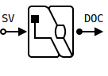

# SvDocGen - Verilog Documentation Generator

SvDocGen generates Verilog source code documentation in mdBook format.

Reasons I made SvDocGen:

1. Doxygen does not support Verilog, and I am not aware of
   any other free tool to document Verilog projects.
2. Doxygen is good for documenting API, but for Verilog projects
   I need a tool to help me to generate documentation
   describing Verilog RTL code and HW designs.
   mdBook with [its features](https://rust-lang.github.io/mdBook/format/mdbook.html)
   seems like a good choice to document RTL with custom .md files
   and information extracted from Verilog code.
3. Both mdBook and [sv-parser](https://github.com/dalance/sv-parser)
   are Rust projects which makes it easy to combine these two.

SvDocGen is primarily used as a command line tool,
even though it exposes all its functionality as a Rust crate
for integration in other projects.

## Examples of Generated Documents

https://igorlesik.github.io/svdocgen

## Installation

1. Load and use prebuilt binaries
   from [Release](https://github.com/igorlesik/svdocgen/releases).
2. cargo not published yet

<!--hidden notes
Github action to build binaries for releases:
https://github.com/marketplace/actions/rust-release-binary
end of hidden notes-->